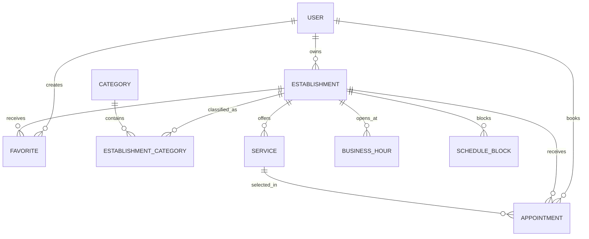

# Modelagem do banco de dados

## Escopo do MVP

A modelagem atende cadastro de clientes e proprietarios, catalogo de
estabelecimentos e servicos, favoritos, disponibilidade e agendamentos.
Profissionais, pagamentos, avaliacoes, notificacoes e recorrencia ficam fora
deste card.

## Regras de dominio

- Um usuario possui um papel no MVP: `CLIENT` ou `OWNER`.
- Um proprietario pode possuir varios estabelecimentos.
- Cada estabelecimento opera com uma agenda unica no MVP.
- Cada agendamento possui um cliente, estabelecimento e servico.
- Cada agendamento representa somente um servico.
- Preco, nome e duracao do servico sao copiados para o agendamento para
  preservar o historico.
- Cancelamentos alteram o status e nao removem o registro.
- Datas de eventos sao armazenadas em UTC (`timestamptz`).
- O timezone do estabelecimento e usado para montar e exibir sua agenda.
- Horarios de funcionamento usam minutos desde meia-noite e aceitam mais de
  um intervalo no mesmo dia.
- Agendamentos ativos de um estabelecimento nao podem se sobrepor.
- A validacao de disponibilidade deve considerar horarios de funcionamento,
  bloqueios e agendamentos ativos dentro da mesma transacao.

## Entidades

- `User`: identidade, autenticacao e papel do usuario.
- `Establishment`: perfil, endereco, coordenadas e proprietario.
- `Category`: taxonomia usada na descoberta de estabelecimentos.
- `EstablishmentCategory`: relacionamento N:N entre estabelecimentos e categorias.
- `Service`: servico, preco decimal, duracao e disponibilidade.
- `Appointment`: reserva e snapshots historicos do servico.
- `Favorite`: relacionamento N:N entre clientes e estabelecimentos.
- `BusinessHour`: intervalos semanais de funcionamento.
- `ScheduleBlock`: indisponibilidades excepcionais da agenda.

## Diagrama

## Convencoes

- Models e campos Prisma usam PascalCase/camelCase.
- Tabelas, colunas, enums, constraints e indices usam `snake_case`.
- IDs sao UUIDs.
- Valores monetarios usam `decimal(10,2)`.
- Entidades mutaveis possuem `created_at` e `updated_at`.
- Exclusoes de dados historicos usam `RESTRICT`; dados dependentes sem valor
  historico usam `CASCADE`.

## Evolucao prevista

Quando houver agenda por profissional, adicionar `Professional`,
`ProfessionalService` e a referencia `professional_id` em `Appointment`.
A constraint de sobreposicao devera entao usar o profissional, e nao apenas o
estabelecimento.
